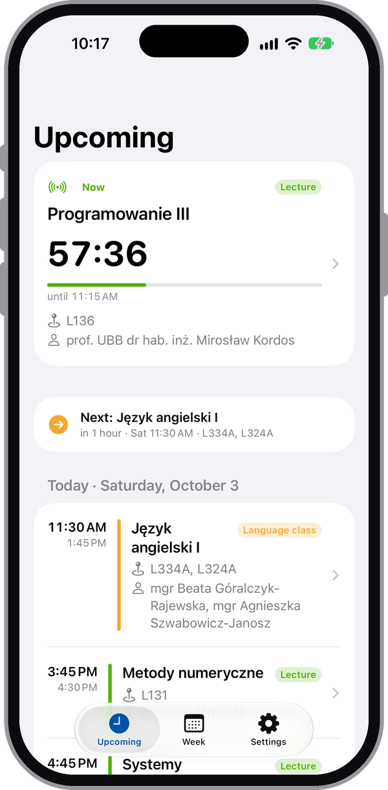
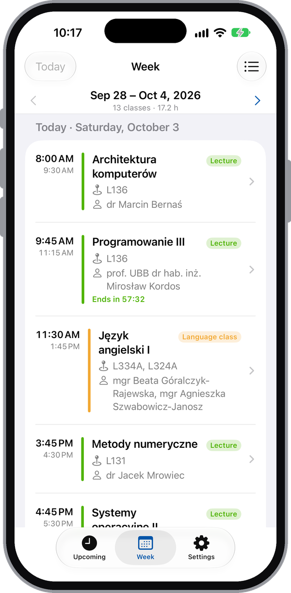
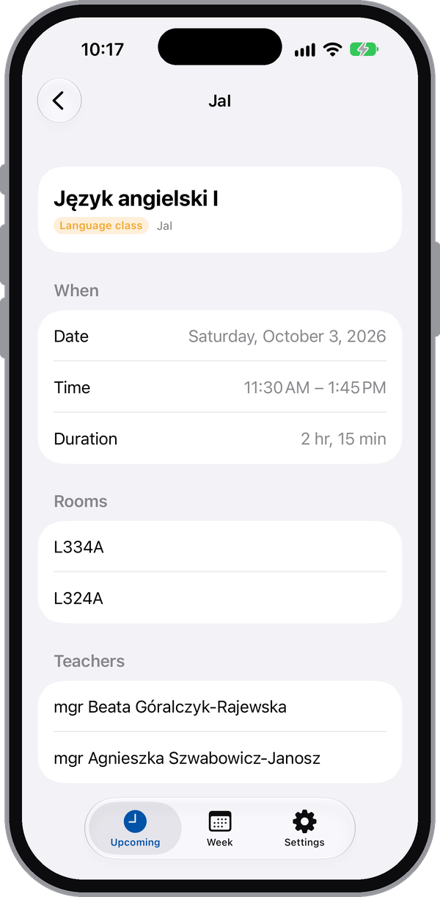
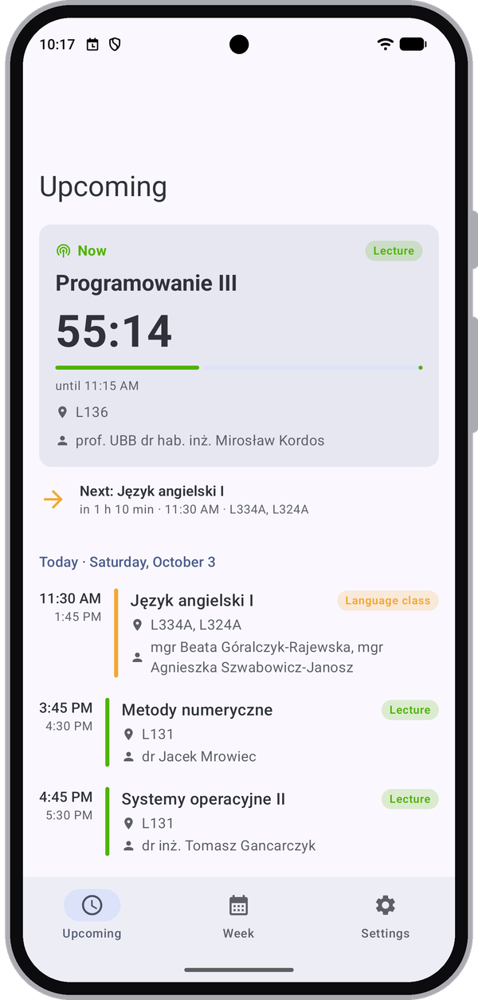
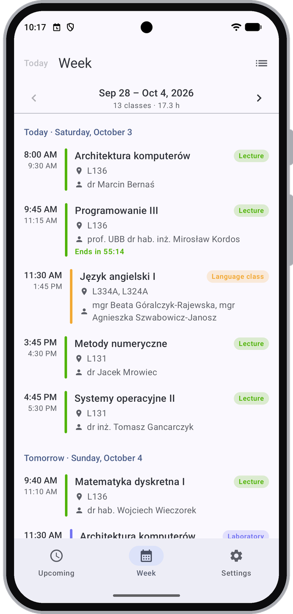
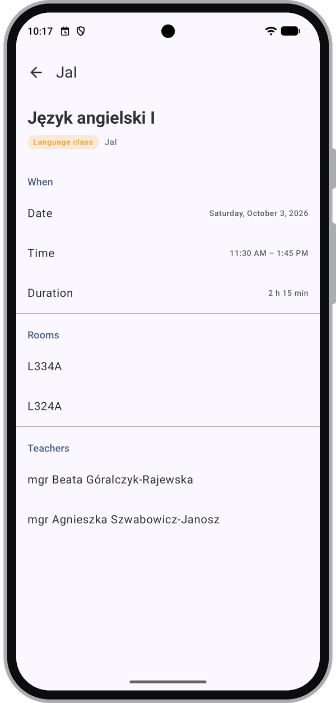

# Plan UBB

iOS app (SwiftUI + WidgetKit, in `ios/`) and Android app (Kotlin + Jetpack Compose, in `android/`) for class schedules from [plany.ubb.edu.pl](https://plany.ubb.edu.pl).
On first launch you pick your group from the same tree as the site's left frame. You can change it later in Settings (or paste any plan URL there).

<p align="center">
  
  
  
</p>
<p align="center">
  
  
  
</p>
<p align="center"><sub>iOS (top) and Android (bottom): Upcoming, Week and a class's details.</sub></p>

## Installation

Each app has a script that builds it and installs it on a phone connected to your Mac over USB, then opens it.

### iPhone

You need Xcode and [XcodeGen](https://github.com/yonaskolb/XcodeGen) (`brew install xcodegen`).
`ios/install-on-device.sh` signs the app with a personal (free) Apple team:

```sh
ios/install-on-device.sh                              # Release build, first paired iPhone on USB
CONFIGURATION=Debug ios/install-on-device.sh
DEVICE_ID=<udid> TEAM_ID=<team> ios/install-on-device.sh
```

- The phone must be unlocked and paired ("Trust This Computer"). `xcrun devicectl list devices` shows the UDIDs.
- The team defaults to `SXHAS82KZJ`. Pass yours with `TEAM_ID`; find it in Xcode → Settings → Accounts.
- Xcode renews the provisioning profiles when needed (`-allowProvisioningUpdates`). The build goes to `ios/build/device`.
- On the first install, iOS may refuse to open the app until you trust your Apple ID in Settings → General → VPN & Device Management.
- Apps signed with a free team stop opening after 7 days. Run the script again to re-sign and reinstall them.

### Android

You need a JDK 17+ and the Android SDK (API 37); Android Studio includes both.
`android/install-on-device.sh` signs the app with your local debug key:

```sh
android/install-on-device.sh                          # release build, first phone on USB
BUILD_TYPE=debug android/install-on-device.sh
DEVICE_ID=<serial> android/install-on-device.sh
```

- Turn on Developer options → USB debugging on the phone, and accept the "Allow USB debugging" prompt. `adb devices -l` shows the serials.
- Release builds are signed with the local debug key (`~/.android/debug.keystore`, created if missing), so debug and release installs can replace each other. The key is passed as Gradle properties, so there's no signing config in `build.gradle.kts`. Use a real key for anything you publish.
- Unlike the iOS free team, the install doesn't expire.

## Features

- **Group picker**: department → study mode → course → degree → semester → group → lab subgroup.
  Each level is downloaded as you open it. Every level is searchable.
  Semesters and groups are plans too, so you can also pick a whole group.
- **Upcoming**: the class running now with a live countdown, the next class, and the next 30 classes grouped by day (time, subject, room, teacher).
- **Week**: the full schedule for any week. Use the arrows or swipe to change weeks, "Today" to jump back, and the list menu to jump to any week that has classes.
- **Widget**: "Current class" for the lock screen (rectangular, inline, circular) and the home screen (small, medium).
  It shows a countdown to the end of the running class, with its subject, room and teacher. Between classes it shows the next one.
- **Live Activity**: a Lock Screen banner and Dynamic Island for the class day.
  It shows a big countdown, the room, the subject and teacher, and a timeline of the whole day (the expanded Dynamic Island also has a progress bar for the class).
  It starts when you open the app during a class or up to an hour before one (or with Settings → Start now).
  It ends when the day's classes are over. You can turn it off in Settings.

### How the Live Activity stays current

There's no push server, so the app can only start the activity while it's open.
The activity's state holds the whole day's classes, and the views work out "in class / break / done" when they render.
Countdowns and progress bars are drawn by the system, so they keep ticking with no updates.
At each class start or end, the app sets `staleDate` (so the system redraws the banner then) and asks for a background refresh to push a fresh update.
iOS limits a Live Activity to 8 hours, so on very long days you need to open the app again.

## Languages

Both apps are in English and Polish and follow the phone's language. You can also choose the language for just this app: on iOS in Settings → Plan UBB → Language, and on Android 13+ in Settings → Apps → Plan UBB → Language. Dates, times and relative times ("in 1 hour", "za 1 godzinę") use the phone's regional format.

| | iOS | Android |
|---|---|---|
| Strings | `ios/Shared/Localizable.xcstrings`: one String Catalog, compiled into the app and the widget | `android/app/src/main/res/values/strings.xml` (English), `values-pl/strings.xml` (Polish) |
| Plurals | Plural variations in the catalog ("1 class", "5 zajęć") | `<plurals>` |

To add a string, use it in a SwiftUI `Text`/`Label`/`Button`, or `String(localized:)` elsewhere. Xcode adds it to the catalog the next time you build in the IDE; then fill in the Polish column. On Android, add it to both `strings.xml` files (lint reports missing translations).
The UI tests launch the app in English (`-AppleLanguages (en)`), because they look for English labels.

## How the data is fetched

| What | Source |
|---|---|
| Group tree | `left_menu.php` (departments), then `left_menu_feed.php?type=1&branch=<id>&link=0&bOne=1` per level |
| Events (whole semester) | `plan.php?type=0&id=…&cvsfile=true` (ICS export) |
| Full subject names | the legend on the weekly HTML pages (`&w=<weekId>`) |
| Full teacher names | each teacher's plan page (`type=10&id=…`) |

The HTML pages need the `winW`/`winH` query parameters. Without them the server sends back a JavaScript stub instead of the plan.
Name lookups are cached (`NameDirectory`), so later refreshes only download the ICS and the current week.

The app and the widget share a cache through the App Group `group.it.mwojtowicz.PlanUbb`.
If that cache is older than 6 hours, the widget refreshes it itself.

## Project layout

```
ios/               iOS app (below)
android/           Android app (see "Android")
test-fixtures/     real captured responses, used by the parser tests of both apps
docs/screenshots/  README screenshots, and frame.py, which draws the phone frames
```

iOS, inside `ios/`:

```
App/       SwiftUI app (tabs: Upcoming, Week, Settings)
Widget/    WidgetKit extension
Shared/    models, ICS/HTML parsers, network service, store (compiled into both targets)
Tests/     parser tests (fixtures in ../test-fixtures)
UITests/   UI tests: tabs/scroll/details after lock-unlock, backgrounding and rotation;
           optional lock-screen widget gallery check
project.yml  XcodeGen spec
```

## Building

```sh
brew install xcodegen      # once
cd ios
xcodegen generate
open PlanUbb.xcodeproj
```

To run on a real iPhone, set your team in `ios/project.yml` (`DEVELOPMENT_TEAM`) or in Xcode's Signing settings.
If the bundle IDs or the App Group are already taken in your account, change `it.mwojtowicz.*` and `group.it.mwojtowicz.PlanUbb` in both `ios/project.yml` and `ios/Shared/ScheduleStore.swift`.
To install from the command line instead, see [Installation](#installation).

Tests (from `ios/`): `xcodebuild -scheme PlanUbb -destination 'platform=iOS Simulator,name=iPhone 18 Pro' test`

- Add `TEST_RUNNER_SCREENSHOT_DIR=/some/dir` to save screenshots, plus the UI hierarchy on failures.
- UI tests launch with `-UITestPlan 142113` to skip the first-launch picker. `GroupPickerUITests` uses `-UITestResetPlan` and walks the live tree.
- Add `TEST_RUNNER_RUN_LOCKSCREEN_TEST=1` to also run the lock-screen checks: the widget gallery, and the Live Activity on the lock screen. The second one is skipped when no classes are left today. Both change the simulator's lock screen, so they're off by default.

### Simulator tips

- **Lock and unlock:** use the hardware buttons (Device → Lock, ⌘L, then Device → Home, ⇧⌘H).
  On iPhone 18 Pro the locked screen stays in Always-On mode: dimmed, with touches ignored.
  Clicking the screen won't wake it, so it can look like the app froze.
- **Adding the widget:** long-press the lock screen → Customise → Lock Screen → Add Widgets.
  Then scroll the alphabetical list to **Plan UBB** (it's below "News").

## Android

`android/` is a native Kotlin + Jetpack Compose port with the same features:

| iOS | Android |
|---|---|
| Upcoming / Week / Settings tabs | Same screens, Material 3 (dynamic colours on Android 12+) |
| First-launch group picker | Same tree, same short names, search on long levels |
| WidgetKit "Current class" widget | Glance home-screen widget, with a system `Chronometer` countdown |
| Live Activity (Lock Screen + Dynamic Island) | Ongoing notification promoted to a **Live Update** on Android 16+: status-bar countdown chip, and a `ProgressStyle` bar that shows the day's timeline (a coloured segment per class, grey for breaks) |
| Background refresh at class boundaries | Inexact `AlarmManager` alarms at each class start/end and every 5 min while the notification is up; `WorkManager` re-downloads the plan every 6 h |

Unlike iOS, Android lets the app post the notification from the background.
So it appears on its own an hour before the first class, with no need to open the app, and goes away after the last class.
If you swipe it away, it stays hidden until the next day.

Layout:

```
android/app/src/main/java/it/mwojtowicz/planubb/
  data/    models, ICS/HTML/tree parsers, network, store, ClassDay (notification phases)
  ui/      Compose screens, view model, group picker
  live/    live notification, alarms (PlanSync), refresh worker
  widget/  Glance widget
```

Building needs a JDK 17+ (Android Studio's bundled one works) and the Android SDK (API 37):

```sh
cd android
export JAVA_HOME="$HOME/Applications/Android Studio.app/Contents/jbr/Contents/Home"   # if no JDK is on PATH
./gradlew :app:assembleDebug        # app/build/outputs/apk/debug/app-debug.apk
./gradlew :app:testDebugUnitTest    # parser + ClassDay tests, using the same test-fixtures/ as iOS
```

Or open `android/` in Android Studio, or see [Installation](#installation) to install from the command line.

Debug builds take intent extras for testing: `adb shell am start -n it.mwojtowicz.planubb/.ui.MainActivity --ez resetPlan true` brings back the first-launch picker, and `--ei plan 142113` skips it.
